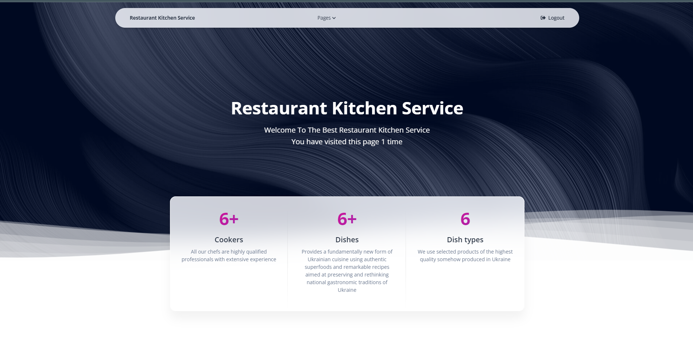

# Restaurant Kitchen Service

It's a simple and stylish restaurant website that allows customers to browse the menu, 
learn about the restaurant and its offerings, and find contact information for our chefs. 
The website contains several pages that present key information:

## Check it out!

[Restaurant Kitchen Service  deployed to Render](https://restaurant-kitchen-service-cx3e.onrender.com)

test user
login: user
password: user12345

## Installation

Phyton3 must be already installed

'''shell
git clone https://github.com/dryzhenko/restaurant_kitchen_service
cd restaurant_kitchen_service
python3 -m venv venv
venv\Scripts\activate (on Windows)
source venv/bin/activate (on macOS)
pip install -r requirements.txt
python3 manage.py runserver # start Django project 
'''

## Features

* Home: Information about the restaurant and its atmosphere.
* Cookers: Detailed description of our cookers.
* Dishes: Detailed description of dishes and drinks.
* Dish type: Information about what types of dishes we prepare and which dishes belong to this type.

## Demo
The site is a showcase of the restaurant, which offers customers that 
this customer can easily find all the information they need.

